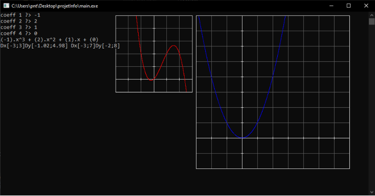

# projet info
Tracé de courbe/polynôme dans la console.

Projet réalisé dans le cadre d'une évalutation de première année à [Polytech Orléans](https://www.univ-orleans.fr/fr/polytech).

## Compilation
`g++ .\src\main.cpp .\src\CFenetre.cpp .\src\CPolynome.cpp -I .\hdr\ -lgdi32 -o main`
